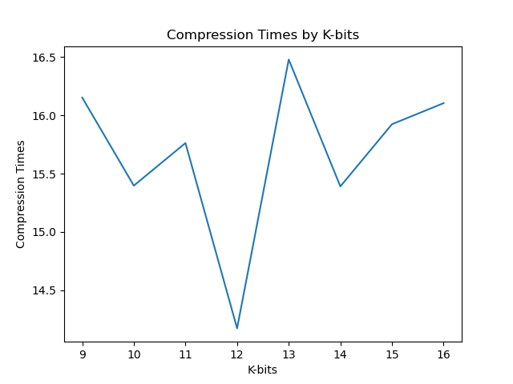
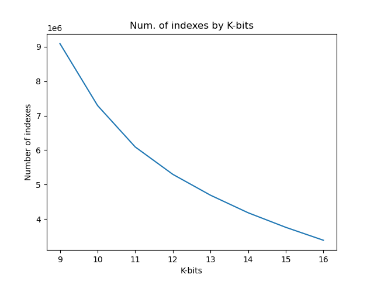
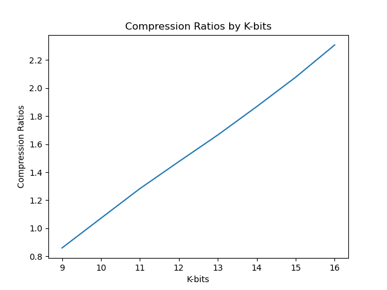
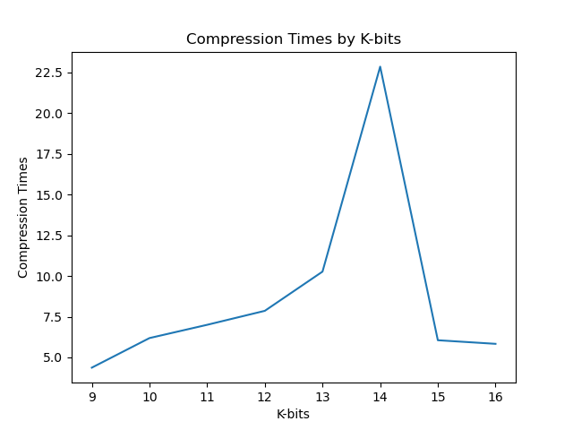
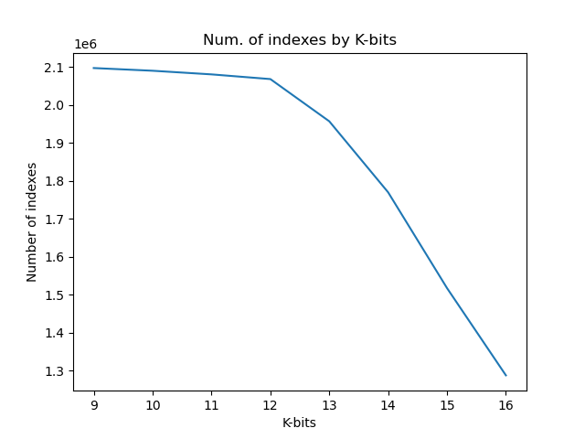
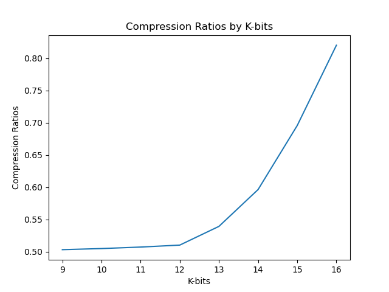

# **LZW Compressor 📚**

## **Sumário:**

1. Equipe
2. Metodologia
3. Análise de Resultados
4. Equipe

## **1. Equipe**

[Ewerton Moura](https://github.com/ewertonASM),
[Renan Goes](https://github.com/Renan-Goes)

## **2. Pontos a serem avaliados no relatório:**  
## &emsp; 2.1. Desenvolveu em qual linguagem? Fez utilizando PPMC ou LZW? Utilizou alguma biblioteca como base?
  
&emsp;O algoritmo escolhido foi o LZW, A solução foi desenvolvida em python, usando suas estruturas de dados nativas, bibliotecas auxiliares foram ultilizadas apenas para salvar o arquivo. 

## &emsp; 2.2. A compressão e descompressão funcionou para os 2 arquivos de testes?
  * **No arquivo de texto, teve algum problema com os caracteres acentuados?**
   Dado, o uso do enconding *ISO/IEC 8859-1*, também conhecido como *latin-1* possibilitou fazer as codificações na compressão sem trazer problemas a caracteres 
  acentuados ou aos bytes que os representavam.
  * **Se não funcionou perfeitamente, qual o problema que ocorreu?**
   Não ocorreram problemas.
  * **O arquivo de vídeo continua sendo "tocável" após a descompressão?**
   Os arquivos mantiveram sua integridade após sua descompressão, sendo possivel reproduzi-los normalmente.

## &emsp; 2.3. Conseguiu fazer com todos os Ks entre 9 e 16?
 &emsp;Todos os valores para *K* especificados foram usados para conpressão e descompressão e não houve nenhum problema no seu uso.

## &emsp; 2.4. Conseguiu salvar a quantidade exata de K bits no arquivo?
 * **Usou qual técnica? Conversão de bits para String? Bitstream? Salvou todos os índices em 2 bytes?**
   Para gerar o arquivo foi ultilizado o metodo *Pack* da biblioteca *Struct*, nativa do python, o que possibilitou salvar todos os indices em 2 bytes. 
  Além disso, também foi necessário fazer uma conversão de bits para string e vice-versa na implementação do algoritmo, para fazer a concatenação dos bytes, 
  por ser o método mais fácil.

## &emsp; 2.4. Apresentou a curva *RC x K* e *Tempo x K* para os 2 arquivos de testes?
 * **Utilizou como equação do RC?**
   A equação utilizada foi: *RC = tamArqOriginal / ((totalIndices\*K)/8)*

## **3. Metodologia** ⚙️

Para o desenvolvimento do projeto foi necessário instalar algumas bibliotecas não-nativas do python para 
realizar os objetivos.

O dicionário do LZW foi criado utilizando a estrutura de dados de dicionário do próprio python, com variáveis 
em formato de byte e inteiro (para o byte e o índice).

Na leitura e escrita de arquivos foi utilizada a biblioteca "struct", que utiliza as funções "pack" e 
"unpack", "pack" serve para colocar as variáveis (inteiros que representam os índices) em formato de bytes 
(a quantidade de bytes utilizados para o armazenamento é determinada na chamada da função), enquanto "unpack" 
lê exatamente a quantidade de bytes que foi determinada e armazena em uma variável.

Outras bibliotecas utilizadas foram o "matplotlib" (versão 3.3.2), para geração dos gráficos, a "fire" 
(versão 0.4.0), para a linha de execução do código e passagem dos argumentos, o "tqdm" (versão 4.50.2) para 
a visualização do progresso da compressão ou descompressão e por último a "colr" (versão 0.9.1) em conjunto 
com o "tqdm" para colorir a barra de progresso.

Por fim, para verificar os resultados foram gerados gráficos de:
* Tempo de compressão por número "k" de bits
* Número de índices utilizados no dicionário por número "k" de bits
* Razão de compressão por número "k" de bits

Os arquivos utilizados para teste foram os pedidos na escecificação ("02.mp4" e "corpus16MB.txt").

## **4. Análise de resultados** 🔎

### **4.1 Arquivo de texto** 📝

*Texto TXT 16 MB*

  
  
  

### **4.2 Arquivo de vídeo 🎞️**

*Video MP4 2,01 MB*

  
  
  

### **4.3 Compreensão dos gráficos**

Como pode ser observado no gráfico do número de índices, quanto maior maior a quantidade de 
bits, menor a quantidade de índices utilizados na compressão, isso porque mais casos podem 
ser armazenados no dicionário, logo, são necessários menos índices para representar o arquivo 
comprimido. Além disso, como o ".mp4" é um formato já comprimido, pode ser observado que a 
quantidade de índices diminui menos e de forma mais lenta.

Já no gráfico de razão de compressão, no arquivo de texto RC aumenta linearmente em relação a quantidade 
de bits, enquanto no vídeo aumenta exponencialmente.

## **5. Rodando a aplicação 🏃‍♂️**

### **5.1. Requisitos:**

Antes de rodar a aplicação, é necessário instalar as depêndencias com os seguintes comandos:
 
>`pip install -r requirements.txt`

### **5.2. Compress** 
>`python main.py -input_file "input/corpus16MB.txt" -bits_number "9" -operation "compress"`
 
### **5.3. Decompress**
>`python main.py -input_file "output/02.mp4.lzw" -bits_number "9" -operation "decompress"`
 
### **5.4. Obs 🔎**
Na compressão, o parâmetro `bits_number` é opcional, se não for usado, o intervalo entre 9 e 16 será usado. 